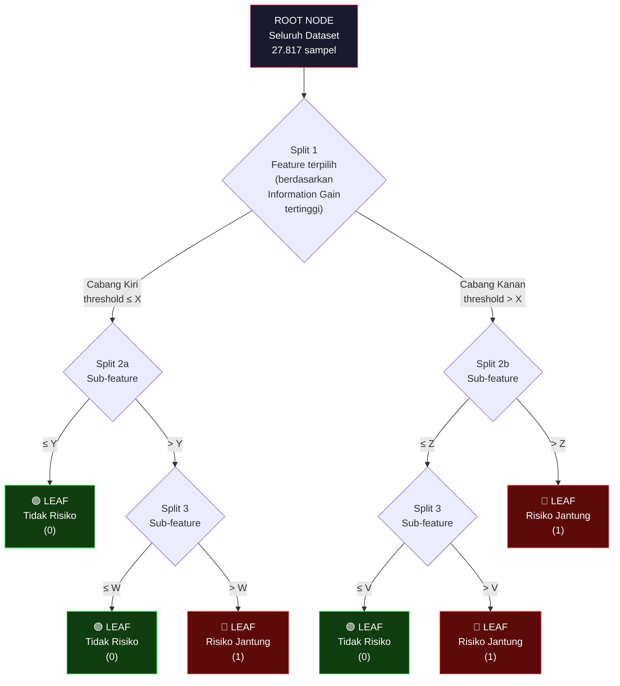
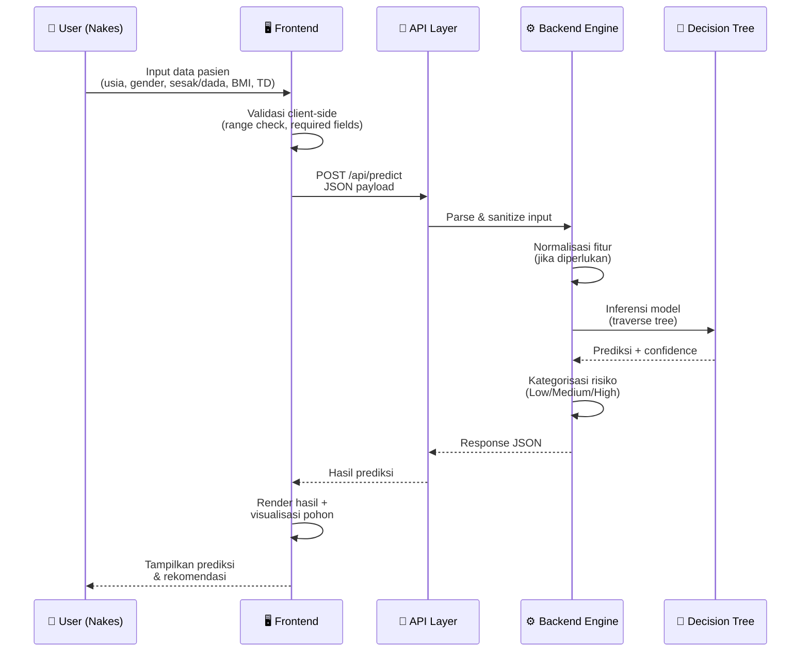
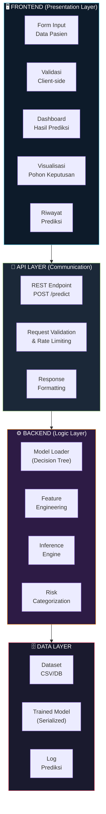

# REQUEST FOR DESIGN (RFD)
# Sistem Pendukung Keputusan Deteksi Dini Risiko Penyakit Jantung
# RSU Aulia — Jagakarsa, Jakarta Selatan
### Kode Dokumen: RFD_SISTEM_DETEKSI_JANTUNG
### Versi: 2.0 | Tanggal: 4 Juni 2026

---

## 1. LATAR BELAKANG KLINIS

### 1.1 Urgensi Deteksi Dini Penyakit Jantung

Penyakit jantung merupakan salah satu penyebab utama kematian pada skala global maupun nasional. Berdasarkan data dari Kementerian Kesehatan RI, prevalensi penyakit kardiovaskular di Indonesia terus menunjukkan tren peningkatan yang signifikan akibat perubahan gaya hidup masyarakat (Kementerian Kesehatan RI, 2024). Deteksi dini menjadi faktor yang sangat krusial untuk menekan angka mortalitas, namun proses klasifikasi risiko secara manual sering kali menghadapi kendala pada hal kecepatan serta akurasi diagnosis awal.

Rumah Sakit Umum (RSU) Aulia, yang berlokasi di Jagakarsa, Jakarta Selatan, merupakan institusi kesehatan yang berkomitmen pada transformasi digital. Berdiri sejak tahun 1986 sebagai rumah bersalin, institusi ini bertransformasi menjadi RSIA pada tahun 2006, dan resmi menjadi RSU pada tahun 2015 (RS Aulia, 2025). RSU Aulia membawa visi **"Menjadi Rumah Sakit yang Memberikan Pelayanan Bermutu dan Profesional Menuju Era Digitalisasi Tahun 2026"**. Dengan ketersediaan fasilitas poliklinik jantung serta pencatatan rekam medis yang terus berkembang, RSU Aulia memiliki potensi besar untuk mengimplementasikan sistem cerdas dalam mendukung keputusan klinis tenaga kesehatan.

### 1.2 Peran Sistem Pendukung Keputusan (SPK)

Sistem Pendukung Keputusan berbasis machine learning menawarkan pendekatan proaktif untuk deteksi dini dengan memanfaatkan parameter medis rutin yang **sudah tersedia** dalam rekam medis pasien, tanpa memerlukan pemeriksaan tambahan yang mahal. SPK ini dirancang untuk:

- **Mempercepat skrining** — Memberikan penilaian risiko secara instan dari data rekam medis harian
- **Mendukung keputusan klinis** — Membantu dokter dalam triase dan prioritas pemeriksaan lanjutan
- **Transparansi klasifikasi** — Menghasilkan aturan if-then yang mudah dipahami tenaga medis (white-box model)
- **Integrasi data riil** — Memanfaatkan fitur-fitur dari rekam medis harian RSU Aulia

### 1.3 Basis Data

Sistem ini dikembangkan menggunakan dataset rekam medis riil yang telah melalui proses preprocessing:

| Parameter | Nilai |
|-----------|-------|
| Sumber data | Rekam medis pasien RSU Aulia (terdeidentifikasi) |
| Total rekord asli | 31.638 |
| Total rekord bersih | **27.817** |
| Kelas positif (risiko jantung) | 3.522 (12,7%) |
| Kelas negatif (tidak risiko) | 24.295 (87,3%) |
| Variabel input | 6 fitur (5 numerik + 1 binary) |
| Variabel output | 1 (binary: risiko / tidak risiko) |
| Basis label | Kode diagnosis ICD-10 kategori I (I10–I79) |
| File output | `dataset_cleaned.csv` |

---

## 2. SPESIFIKASI VARIABEL INPUT MEDIS

### 2.1 Tabel Variabel

| No | Variabel | Tipe | Rentang | Satuan | Deskripsi Klinis |
|----|----------|------|---------|--------|------------------|
| 1 | `usia` | Float | 0.00 – 92.15 | Tahun | Usia pasien — faktor risiko utama non-modifiable |
| 2 | `gender` | Integer | 0 – 1 | Binary | Jenis kelamin: 0=Laki-laki, 1=Perempuan |
| 3 | `keluhanawal_sesak_dada` | Integer | 0 – 1 | Binary | 1=ada keluhan sesak napas/nyeri dada, 0=tidak ada |
| 4 | `bmi` | Float | 0.62 – 99.13 | kg/m² | Indeks Massa Tubuh — indikator adipositas |
| 5 | `sistolik` | Integer | 58 – 288 | mmHg | Tekanan darah sistolik — tekanan saat jantung berkontraksi |
| 6 | `diastolik` | Integer | 0 – 183 | mmHg | Tekanan darah diastolik — tekanan saat jantung relaksasi |

> **Catatan fitur `keluhanawal_sesak_dada`:**
> Fitur ini diekstrak dari kolom teks `keluhanawal` menggunakan keyword matching:
> `sesak`, `sesek`, `nafas berat`, `ngos-ngos`, `nyeri dada`, `dada sakit`, `dada nyeri`, `chest pain`.
> Dari 27.817 baris: 831 (3,0%) positif, 26.986 (97,0%) negatif.
> Secara klinis, **24,3% pasien dengan keluhan sesak/dada ternyata memiliki diagnosis jantung** — menunjukkan korelasi kuat.

### 2.2 Variabel Output (Target)

| Variabel | Tipe | Nilai | Deskripsi |
|----------|------|-------|-----------|
| `risiko_jantung` | Integer | **0** = Tidak berisiko | Tidak terdeteksi diagnosis kardiovaskular |
| | | **1** = Berisiko | Terdeteksi diagnosis ICD-10 I10–I79 |

> **Cakupan Diagnosis ICD-10 untuk Label Positif:**
> - I10–I15: Penyakit hipertensi
> - I20–I25: Penyakit jantung iskemik (PJK, angina, infark miokard)
> - I26–I52: Penyakit jantung lainnya (gagal jantung, aritmia, valvular)
> - I60–I69: Penyakit serebrovaskular (stroke iskemik, hemoragik)
> - I70–I79: Penyakit arteri, arteriol, dan kapiler

### 2.3 Statistik Deskriptif Variabel

| Variabel | Mean | Median | Std Dev | Min | Max |
|----------|------|--------|---------|-----|-----|
| `bmi` | 24,13 | 23,43 | 5,59 | 1,00 | 99,13 |
| `usia` | 46,47 | 50,48 | 19,93 | 0,00 | 92,15 |
| `sistolik` | 125,60 | 123,00 | 21,53 | 58 | 288 |
| `diastolik` | 80,28 | 80,00 | 12,06 | 0 | 183 |

---

## 3. SPESIFIKASI MODEL: DECISION TREE

### 3.1 Justifikasi Pemilihan Algoritma

Decision Tree (Pohon Keputusan) dipilih sebagai algoritma utama untuk SPK ini berdasarkan beberapa pertimbangan:

| Aspek | Justifikasi |
|-------|-------------|
| **Interpretabilitas** | Menghasilkan aturan keputusan yang dapat dibaca secara langsung oleh tenaga medis (if-then rules) |
| **Transparansi** | Setiap prediksi dapat ditelusuri alurnya — penting untuk konteks medis yang membutuhkan akuntabilitas |
| **Non-parametrik** | Tidak mengasumsikan distribusi data tertentu, cocok untuk data medis yang heterogen |
| **Fitur campuran** | Mampu menangani variabel numerik (bmi, usia, sistolik, diastolik) dan binary (gender, keluhanawal_sesak_dada) secara bersamaan |
| **Efisiensi** | Kompleksitas inferensi O(depth) — prediksi real-time tanpa komputasi berat |

### 3.2 Struktur Pohon Keputusan



### 3.3 Parameter Konfigurasi Model

| Parameter | Nilai | Alasan |
|-----------|-------|--------|
| `criterion` | `entropy` (Information Gain) | Menghasilkan split yang lebih informatif untuk klasifikasi biner |
| `max_depth` | 5–10 (tuning) | Mencegah overfitting, menjaga interpretabilitas |
| `min_samples_split` | 20–50 | Memastikan split node memiliki cukup sampel representatif |
| `min_samples_leaf` | 10–25 | Mencegah leaf node dengan sampel terlalu kecil |
| `class_weight` | `balanced` | Menangani ketidakseimbangan kelas (rasio 1:6,9) |
| `splitter` | `best` | Memilih split terbaik di setiap node |

### 3.4 Kriteria Split: Information Gain

Setiap node internal memilih fitur dan threshold split berdasarkan **Information Gain** tertinggi:

```
Information Gain (S, A) = Entropy(S) - Σ (|Sv| / |S|) × Entropy(Sv)
```

Dimana:
- `S` = himpunan sampel pada node saat ini
- `A` = atribut/fitur kandidat split
- `Sv` = subset sampel setelah split berdasarkan nilai atribut A

### 3.5 Strategi Penanganan Class Imbalance

Karena distribusi label target tidak seimbang (12,7% positif vs 87,3% negatif), diterapkan strategi berikut:

| Strategi | Detail |
|----------|--------|
| **Class Weight Balancing** | Bobot kelas otomatis: `w_i = n_total / (n_classes × n_i)` |
| **Stratified Split** | Train-test split mempertahankan proporsi kelas |
| **Metrik Evaluasi** | Precision, Recall, F1-Score, ROC-AUC (bukan hanya Accuracy) |

---

## 4. SKEMA ALUR SISTEM

### 4.1 Alur Pemrosesan Data End-to-End

```mermaid
flowchart LR
    subgraph INPUT["📋 INPUT PASIEN"]
        I1["Usia (tahun)"]
        I2["Gender"]
        I3["Sesak/Nyeri Dada"]
        I4["BMI (kg/m²)"]
        I5["Sistolik (mmHg)"]
        I6["Diastolik (mmHg)"]
    end

    subgraph BACKEND["⚙️ BACKEND PROCESSING"]
        V["Validasi Input<br/>& Normalisasi"]
        M["Model Decision Tree<br/>(Trained)"]
        P["Post-processing<br/>Confidence Score"]
    end

    subgraph OUTPUT["📊 OUTPUT PREDIKSI"]
        R1["🟢 Risiko Rendah"]
        R2["🟡 Perlu Evaluasi"]
        R3["🔴 Risiko Tinggi"]
    end

    INPUT --> V --> M --> P --> OUTPUT

    style INPUT fill:#0d1b2a,stroke:#48cae4,color:#fff
    style BACKEND fill:#1b2838,stroke:#f77f00,color:#fff
    style OUTPUT fill:#1a1a2e,stroke:#e94560,color:#fff
```



### 4.2 Alur Prediksi Detail



---

## 5. ARSITEKTUR PENGEMBANGAN

### 5.1 Pembagian Peran Frontend–Backend (Horizontal)



### 5.2 Tanggung Jawab Per Layer

#### 🖥️ Frontend (Presentation Layer)

| Komponen | Tanggung Jawab | Teknologi |
|----------|----------------|-----------|
| Form Input | Menerima data pasien dengan UX yang ramah nakes | HTML/CSS/JS |
| Validasi Client | Cek rentang BMI (1–100), usia (0–120), TD (50–300) | JavaScript |
| Dashboard Hasil | Menampilkan prediksi dengan kode warna risiko | Responsive CSS |
| Visualisasi Tree | Menampilkan alur keputusan yang dilalui | Canvas/SVG |
| Riwayat | Menyimpan & menampilkan prediksi sebelumnya | LocalStorage |

**Prinsip Desain Frontend:**
- Responsive design — mendukung desktop dan tablet di klinik
- Warna kode risiko: 🟢 Rendah (hijau), 🟡 Sedang (kuning), 🔴 Tinggi (merah)
- Form input minimalis — 6 field (4 numerik + 2 pilihan), bisa diisi dalam <30 detik
- Hasil prediksi instan tanpa reload halaman (AJAX)

#### ⚙️ Backend (Logic Layer)

| Komponen | Tanggung Jawab | Detail |
|----------|----------------|--------|
| Model Loader | Memuat model Decision Tree yang sudah di-train | Load dari file serialized (.pkl / .json) |
| Feature Engineering | Memastikan format input sesuai harapan model | Tipe data, encoding, urutan fitur |
| Inference Engine | Menjalankan prediksi melalui traversal pohon | Kompleksitas O(depth) per prediksi |
| Risk Categorization | Mengkategorikan confidence score ke level risiko | Low (<30%), Medium (30–70%), High (>70%) |

**Prinsip Desain Backend:**
- Model inference tanpa dependency berat — cukup logika if-else dari pohon yang sudah di-train
- Stateless API — setiap request independen
- Input sanitization — mencegah injeksi dan data anomali

---

## 6. RANCANGAN ANTARMUKA INPUT-OUTPUT

### 6.1 Spesifikasi Form Input

```
┌─────────────────────────────────────────────────────┐
│    SPK DETEKSI DINI RISIKO PENYAKIT JANTUNG        │
│    RSU Aulia — Jagakarsa, Jakarta Selatan           │
├─────────────────────────────────────────────────────┤
│                                                     │
│  Usia (tahun)        [________] (0 – 120)           │
│                                                     │
│  Jenis Kelamin       ○ Laki-laki  ○ Perempuan       │
│                                                     │
│  Keluhan Sesak Napas / Nyeri Dada:                  │
│                      ○ Tidak Ada   ○ Ada            │
│                                                     │
│  BMI (kg/m²)         [________] (1.00 – 100.00)     │
│                                                     │
│  Tekanan Darah Sistolik   [____] mmHg (50–300)      │
│  Tekanan Darah Diastolik  [____] mmHg (30–200)      │
│                                                     │
│             [ 🔍 ANALISIS RISIKO ]                  │
│                                                     │
└─────────────────────────────────────────────────────┘
```

### 6.2 Spesifikasi Output Prediksi

```
┌─────────────────────────────────────────────────┐
│              HASIL ANALISIS RISIKO              │
├─────────────────────────────────────────────────┤
│                                                 │
│       ████████████████████████████████          │
│       █     🔴 RISIKO TINGGI        █          │
│       █     Confidence: 87.3%        █          │
│       ████████████████████████████████          │
│                                                 │
│  Alur Keputusan:                                │
│  ┌─ Usia (67 th) > 55 ──────────────┐          │
│  │  └─ Sistolik (178) > 140 ────────┤          │
│  │     └─ BMI (28.6) > 25 ──────────┤          │
│  │        └─ → RISIKO TINGGI ●      │          │
│  └──────────────────────────────────┘          │
│                                                 │
│  Rekomendasi:                                   │
│  • Rujuk ke dokter spesialis jantung            │
│  • Pemeriksaan EKG dan ekokardiografi           │
│  • Evaluasi profil lipid dan gula darah         │
│                                                 │
└─────────────────────────────────────────────────┘
```

---

## 7. METRIK EVALUASI MODEL

### 7.1 Metrik yang Digunakan

| Metrik | Formula | Target | Prioritas |
|--------|---------|--------|-----------|
| **Recall (Sensitivity)** | TP / (TP + FN) | ≥ 80% | ⭐ **Tertinggi** — Meminimalkan false negative (pasien berisiko yang lolos) |
| **Precision** | TP / (TP + FP) | ≥ 60% | Tinggi — Mengurangi rujukan yang tidak perlu |
| **F1-Score** | 2 × (P×R)/(P+R) | ≥ 70% | Tinggi — Keseimbangan precision-recall |
| **Accuracy** | (TP+TN)/Total | ≥ 85% | Sedang — Informatif tapi bisa menyesatkan pada data imbalanced |
| **ROC-AUC** | Area Under Curve | ≥ 0.80 | Tinggi — Evaluasi menyeluruh di semua threshold |
| **Specificity** | TN / (TN + FP) | ≥ 75% | Sedang — Mengurangi false alarm |

> **⚠️ Catatan Klinis:** Dalam konteks deteksi dini, **Recall lebih diprioritaskan** daripada Precision. Lebih baik merujuk pasien sehat untuk pemeriksaan lanjutan (false positive), daripada meloloskan pasien berisiko tanpa penanganan (false negative).

### 7.2 Strategi Validasi

| Metode | Detail |
|--------|--------|
| **Train-Test Split** | 80% training, 20% testing (stratified) |
| **K-Fold Cross Validation** | k=5 atau k=10, stratified |
| **Confusion Matrix** | Analisis detail TP, TN, FP, FN |

---

## 8. SKENARIO PENGGUNAAN

### 8.1 Skenario 1: Pasien dengan Keluhan Sesak di Poliklinik Jantung RSU Aulia

> Pasien laki-laki, 58 tahun, BMI 27,5, keluhan sesak napas (+), tekanan darah 145/95 mmHg. Dokter menginput data ke sistem → Sistem memprediksi **risiko tinggi** → Pasien dirujuk untuk pemeriksaan EKG dan ekokardiografi.

### 8.2 Skenario 2: Kontrol Pasien Hipertensi di RSU Aulia

> Pasien perempuan, 62 tahun, BMI 31,2, keluhan sesak/nyeri dada (-), tekanan darah 158/98 mmHg kontrol rutin hipertensi. Sistem mendeteksi **risiko tinggi** berdasarkan kombinasi usia, BMI tinggi, dan hipertensi → Rekomendasi pemeriksaan lanjutan.

### 8.3 Skenario 3: Pasien Muda Sehat

> Pasien laki-laki, 25 tahun, BMI 22,3, keluhan sesak/nyeri dada (-), tekanan darah 118/76 mmHg. Sistem memprediksi **risiko rendah** → Tidak perlu rujukan tambahan.

---

## 9. BATASAN & DISCLAIMER

### 9.1 Batasan Sistem

| Batasan | Dampak |
|---------|--------|
| Hanya menggunakan 6 variabel input | Tidak mencakup faktor risiko seperti kolesterol, riwayat keluarga, merokok, aktivitas fisik, HbA1c |
| Label berbasis kode ICD-10 retrospektif | Bukan label klinis prospektif dari kardiolog |
| Data dari satu institusi (RSU Aulia) | Generalisabilitas perlu divalidasi untuk populasi lain |
| Class imbalance (1:6,9) | Berpotensi bias terhadap kelas mayoritas |
| `keluhanawal_sesak_dada` sparse (3%) | Mayoritas baris bernilai 0, tetap relevan secara klinis |

### 9.2 Disclaimer

> **Sistem ini merupakan alat bantu skrining (screening tool) dan BUKAN pengganti diagnosis medis profesional.** Hasil prediksi harus dikonfirmasi oleh dokter di RSU Aulia melalui pemeriksaan klinis lengkap. Sistem tidak dimaksudkan untuk menegakkan diagnosis definitif.

---

## 10. ROADMAP PENGEMBANGAN

| Fase | Kegiatan | Status |
|------|----------|--------|
| **Fase 1** | Pengumpulan & preprocessing data | ✅ Selesai |
| **Fase 2** | Training model Decision Tree | 🔲 Belum dimulai |
| **Fase 3** | Evaluasi & tuning model | 🔲 Belum dimulai |
| **Fase 4** | Pengembangan frontend (UI) | 🔲 Belum dimulai |
| **Fase 5** | Integrasi backend + model | 🔲 Belum dimulai |
| **Fase 6** | Testing end-to-end | 🔲 Belum dimulai |
| **Fase 7** | Deployment & dokumentasi | 🔲 Belum dimulai |

---

*Dokumen ini bersifat hidup (living document) dan akan diperbarui seiring progres pengembangan.*
